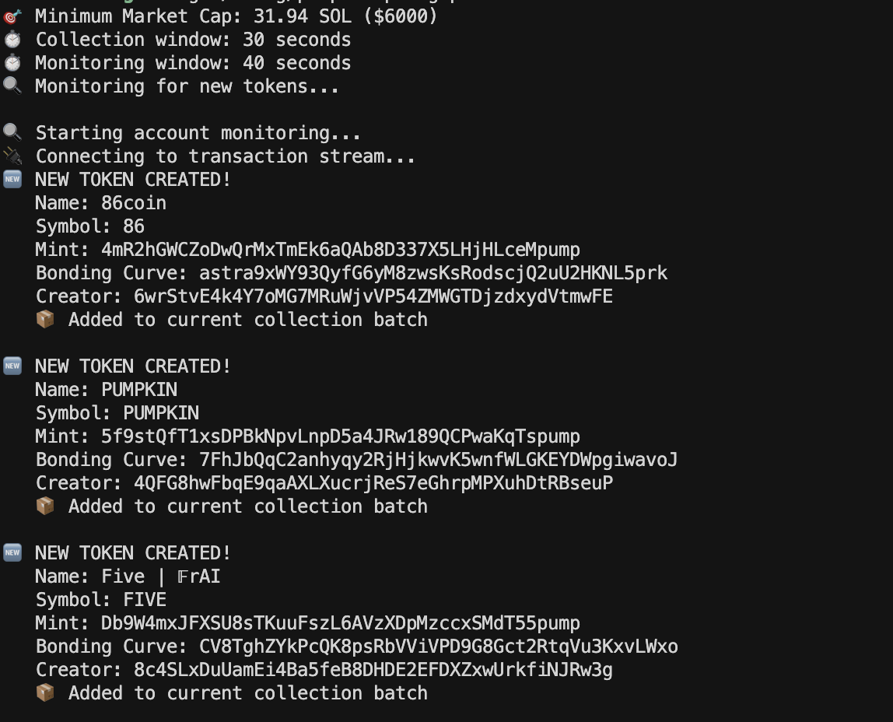
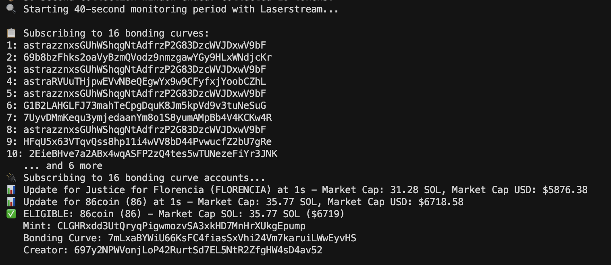
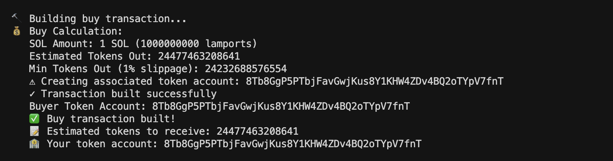
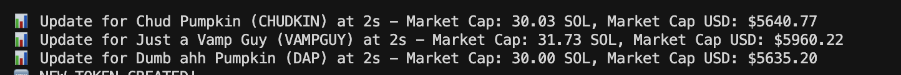

# Pump.fun Token Sniper (Using Laserstream)

A Rust tool that listens to Pump.fun creates via Helius Laserstream, batches new tokens, monitors their bonding curves for 40 seconds, and when a token’s market cap exceeds your target, builds (but does not execute) a buy transaction.

### What it does

- Subscribes to Pump.fun program transactions and parses Pump.fun's CREATE instructions
- Batches newly detected tokens for 30 seconds
- Subscribes to their bonding curve accounts and monitors for 40 seconds
- Computes market cap from bonding curve virtual SOL reserves and current SOL price (Coingecko)
- When above threshold, builds a buy transaction (with slippage) and optionally simulates it

The buy transaction is constructed but not sent on-chain.

## Requirements

- Rust (stable)
- A Helius Laserstream endpoint and API key
- A standard Solana RPC endpoint for simulation (e.g. Helius RPC)

## Folder Structure:

```
pump-sniper-grpc/
├─ Cargo.toml
├─ README.md
└─ src/
   ├─ main.rs                         # App entry: loads config, spawns monitors
   ├─ execute_ixs/
   │  ├─ mod.rs
   │  └─ buy.rs                      # Build/simulate Pump.fun buy transaction (not sent)
   ├─ monitors/
   │  ├─ mod.rs
   │  ├─ monitor_account.rs          # Batch + monitor bonding curve accounts, eligibility logic
   │  └─ monitor_transaction.rs      # Subscribe CREATE txs, push tokens into current batch
   ├─ parser/
   │  ├─ mod.rs
   │  └─ create_instruction.rs       # Parse Pump.fun CREATE instruction (name, symbol)
   ├─ types/
   │  ├─ mod.rs
   │  ├─ token.rs                    # TokenInfo struct and helpers
   │  └─ bonding_curve.rs            # BondingCurve layout + parsing helpers
   └─ utils/
      ├─ mod.rs
      ├─ config.rs                   # Env config + thresholds and printing
      ├─ constants.rs                # Program IDs, discriminators, etc.
      ├─ helper_functions.rs         # Misc helpers (e.g., market cap calc)
      └─ pump_fun_idl.json           # Pump.fun IDL reference
```

## Configure

Create your `.env` from the example and fill the values:

```bash
cp .env.example .env
```

Environment variables used:

- `HELIUS_API_KEY`: Helius API key
- `LASERSTREAM_ENDPOINT`: Laserstream wss endpoint
- `HELIUS_RPC_URL`: HTTPS RPC URL for simulation and account lookups
- `COINGECKO_URL`: Endpoint returning SOL price JSON (e.g. https://api.coingecko.com/api/v3/simple/price?ids=solana&vs_currencies=usd)
- `MIN_MARKET_CAP_USD`: after which you want to buy a token.
- `COLLECTION_WINDOW_SECS`: collects new tokens for 30 second which will be monitored. (set 30 for optimal)
- `MONITORING_WINDOW_SECS`: monitors the collected token for transactions, and buys them if they are above MIN_MARKET_CAP_USD. (set atleast 40 for optimal)
- `BUYER_KEYPAIR`: Base58-encoded keypair string used to derive the buyer pubkey and sign the built transaction (not broadcast)
- `BUY_AMOUNT_LAMPORTS`: Amount of SOL (lamports) to spend (e.g. 100000000 = 0.1 SOL)
- `SLIPPAGE_BPS`: Slippage in basis points for minimum tokens out (e.g. 500 = 5%)

## Run

```bash
cargo build
cargo run
```

You should see logs:

- Transaction stream connected
- Tokens created and added to the 30s batch
- Subscription to bonding curve accounts for the batch
- Per-update market cap checks
- “ELIGIBLE” log when cap crosses threshold
- A built buy transaction (and simulation output) for eligible tokens

## How market cap is computed

Market cap (SOL) = virtual_sol_reserves / 1_000_000_000

We convert to USD using the `COINGECKO_URL` price feed. Threshold checks use `MIN_MARKET_CAP_USD` via `Config::min_market_cap_sol`.

## Buy transaction (not executed)

When a token is eligible, we:

- Compute estimated tokens with slippage
- Ensure/create the buyer’s associated token account
- Build the Pump.fun buy instruction
- Create and sign a transaction using the provided `BUYER_KEYPAIR`
- Optionally simulate it via the configured RPC

Note: The transaction is not sent to the network. You’ll see logs, the estimated tokens, and your token account.

### Some Terminal Screenshots:

</img>
</img>
</img>
</img>
